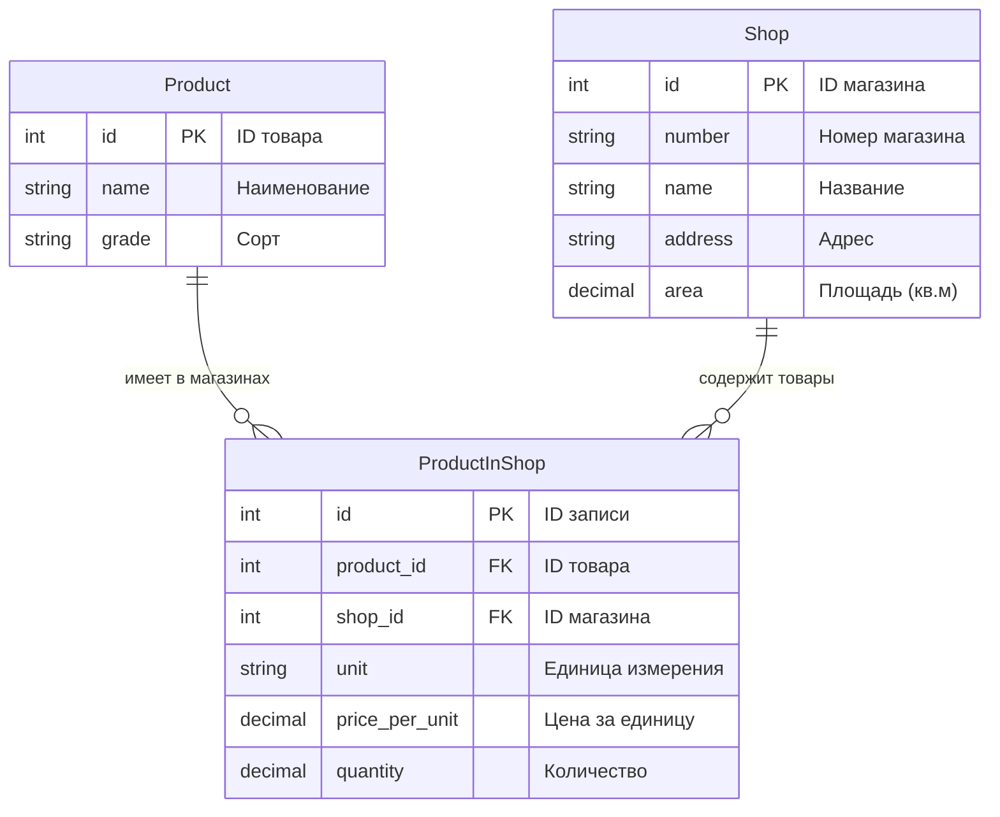

# Лабораторная работа №1.
## Магазины.(Вариант 5)
Имеются товары (наименование и сорт) и магазины (номер, наименование,
адрес и площадь). Для каждого товара в магазине хранится единица
измерения, цена за единицу и количество единиц.

Выходные документы:

• для каждого магазина из заданного списка номеров выдать
информацию о товарах с подсчетом их стоимости,
упорядоченную по наименованиям товаров;

• выдать информацию о магазинах, упорядоченную по их адресам,
с подсчетом средней площади всех магазинов.

## Er-Диаграмма

## Логическая модель

** Product (Товары) **

id — первичный ключ

name — наименование товара

grade — сорт/категория товара

** Shop (Магазины) **

id — первичный ключ

number — номер магазина

name — название магазина

address — адрес магазина

area — площадь в квадратных метрах

** ProductInShop (Товары в магазинах) **

id — первичный ключ

product_id — внешний ключ к таблице Product

shop_id — внешний ключ к таблице Shop

unit — единица измерения (кг, шт, литр и т.д.)

price_per_unit — цена за единицу измерения

quantity — количество единиц товара в магазине
